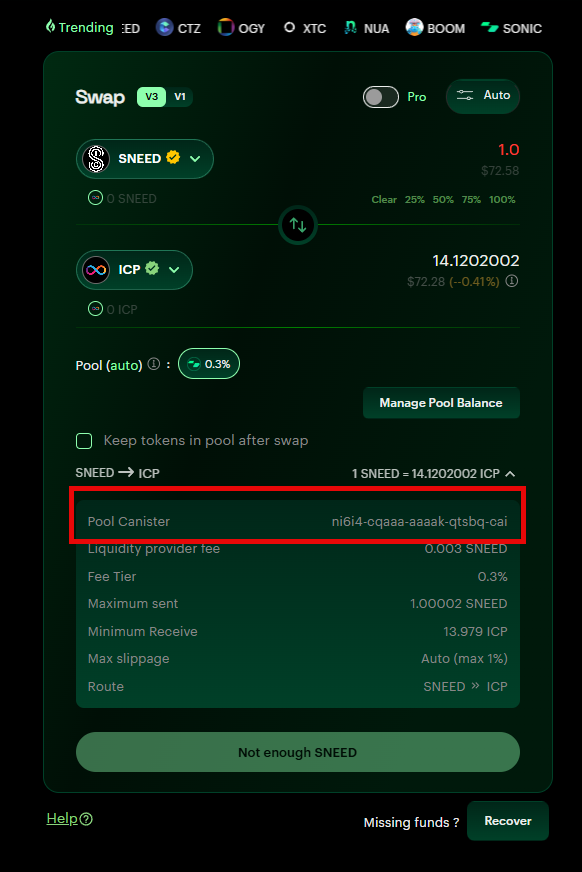

# Researching and learning about the sonic swap containers and Sneed's LP positions

- [2024-02-10, 1:07:27 PM UTC - 220 Sneed Deposited](https://dashboard.internetcomputer.org/sns/fp274-iaaaa-aaaaq-aacha-cai/transaction/5788) into the old Sonic swap canister [3xwpq-ziaaa-aaaah-qcn4a-cai](https://dashboard.internetcomputer.org/canister/3xwpq-ziaaa-aaaah-qcn4a-cai)
- [2024-12-06, 10:07:17 AM UTC - 375 Sneed Transfer](https://dashboard.internetcomputer.org/sns/fp274-iaaaa-aaaaq-aacha-cai/transaction/51548) from the old swap canister to the new swap canister [ni6i4-cqaaa-aaaak-qtsbq-cai](https://dashboard.internetcomputer.org/canister/ni6i4-cqaaa-aaaak-qtsbq-cai) for sonic's migration. New canister is still active and can be inspected and interacted with via the candid interface on the icp dashboard linked. (https://dashboard.internetcomputer.org/canister/ni6i4-cqaaa-aaaak-qtsbq-cai)
- Sneed transactions for the swap canister show active bot trading activity. (https://dashboard.internetcomputer.org/sns/fp274-iaaaa-aaaaq-aacha-cai/account/ni6i4-cqaaa-aaaak-qtsbq-cai)
- One can verify the canister ID in sonic's UI when trying to swap ICP and Sneed


## Calls on the New Swap Canister
Using the icp dashboard interface to interact with the [swap canister](https://dashboard.internetcomputer.org/canister/ni6i4-cqaaa-aaaak-qtsbq-cai), you can verify the following information:

1) The canister is the swap canister for ICP/Sneed
   - Call ```getTokenMeta``` (no parameters required)
        ```
        (
        record {
            token0 = vec {
            record { "name"; variant { Text = "Sneed DAO" } };
            record { "symbol"; variant { Text = "SNEED" } };
            record { "decimals"; variant { Nat = 8 : nat } };
            record { "fee"; variant { Nat = 1_000 : nat } };
            };
            token1 = vec {
            record { "name"; variant { Text = "Internet Computer" } };
            record { "symbol"; variant { Text = "ICP" } };
            record { "decimals"; variant { Nat = 8 : nat } };
            record { "fee"; variant { Nat = 10_000 : nat } };
            };
        },
        )
        ```
    - We see token0 is Sneed and token1 is ICP